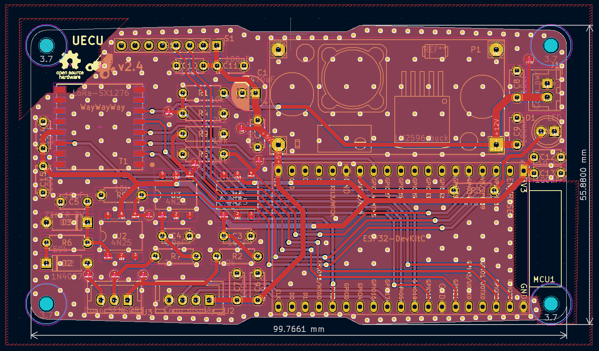
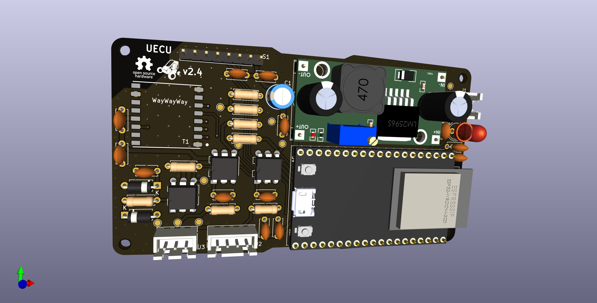
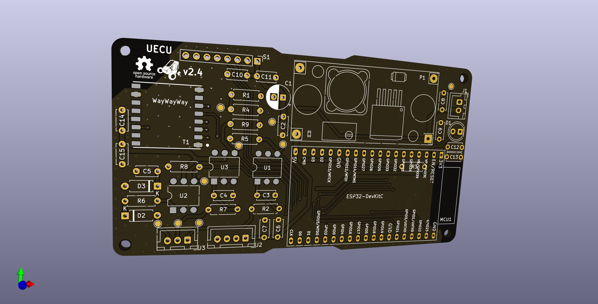
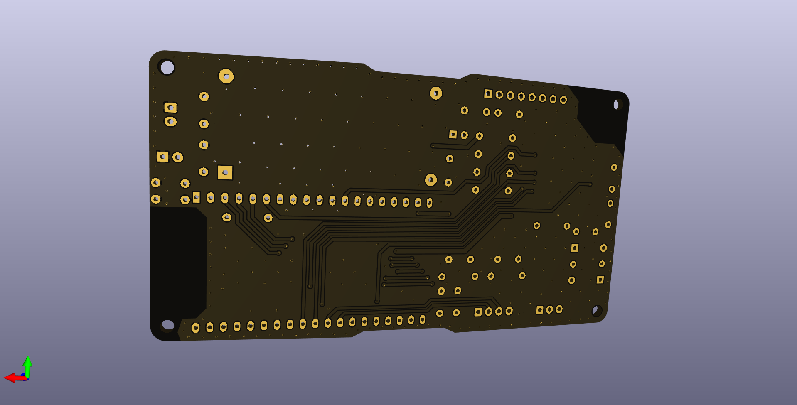
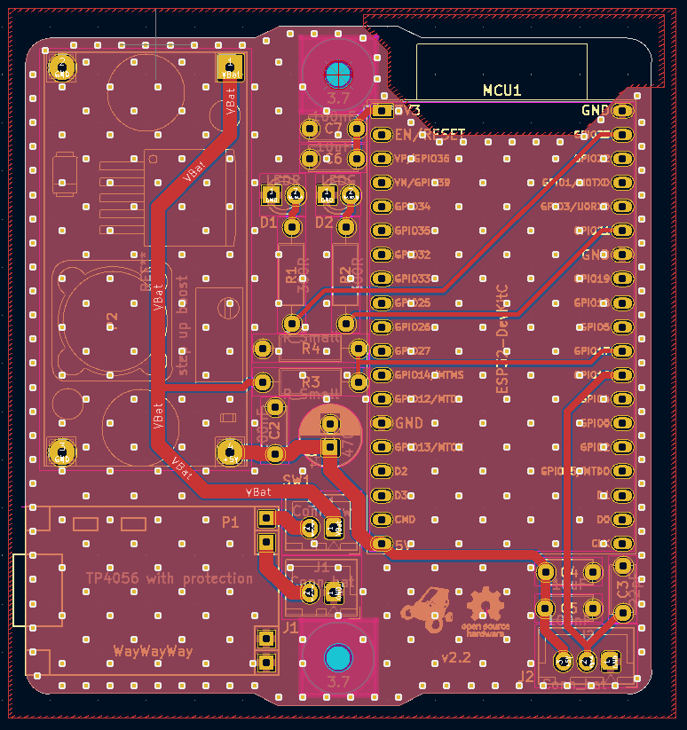
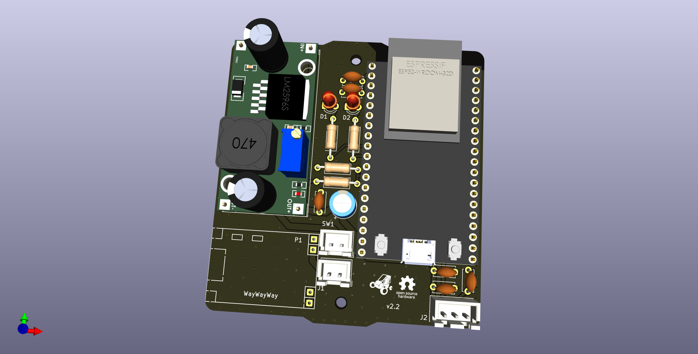
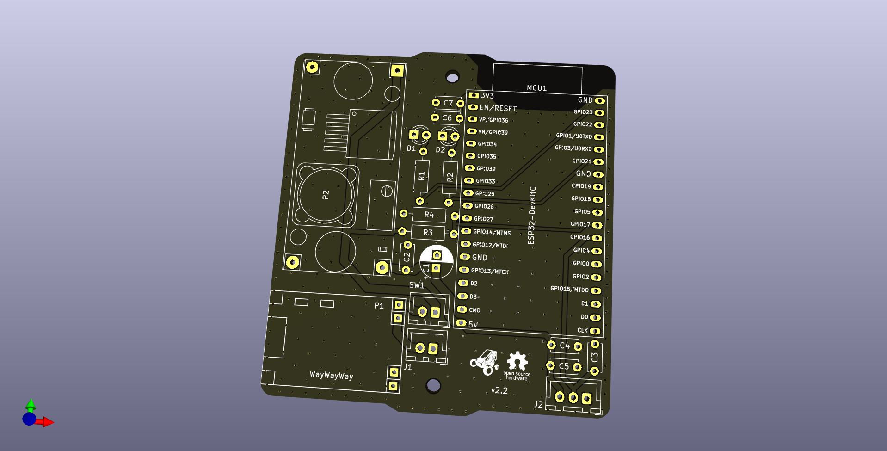
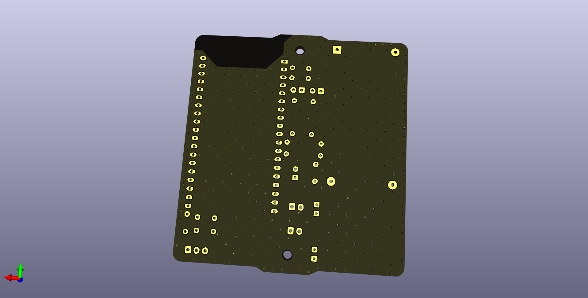

# Hardware v2

    
    
    
    

    
    
    
    

## UECU

Universal Electronics Control Unit

## Module

The Accelaration and Velocity test module

### Signal Cleaning

A signal cleaning stage was employed in the digital inputs of each sensor with the aim of eliminating electromagnetic interference in the data transmission line. For this purpose, a passive low-pass filter with a cutoff frequency of 1GHz was implemented.

To achieve the desired cutoff frequency, based on a resistor of *2.2k* ohms, chosen to maintain the optimal current for the optocoupler's LED, the following calculations were made:

$$
F_c = \frac{1}{{2 \pi R C}}
$$

$$
C = \frac{1}{{F_c \cdot 2 \pi R}}
$$

$$
C = \frac{1}{{1 \text{GHz} \cdot 2 \pi \cdot 2.2k}}
$$

$$
C \approx 72 \text{pF}
$$
